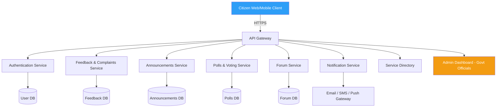
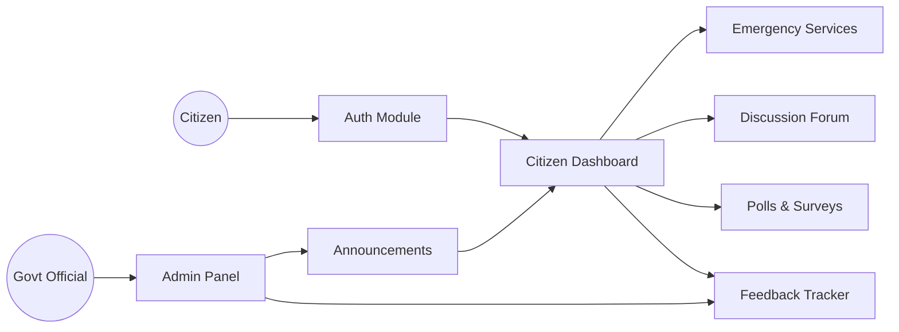

<div align="center">

<!-- Animated Typing Header -->
<a href="https://github.com/">
  
</a>

<br/>

<!-- Banner GIF -->


<br/><br/>

<!-- Badges -->


</div>

---

## 📖 About The Project

**OpenGovtBD** is a modern, secure, and user-friendly **Government–Citizen Communication Platform** designed to strengthen the bridge between citizens and government authorities. It provides a transparent, centralized space for people to share opinions, complaints, suggestions, and feedback — while also serving as a **single digital hub** for accessing official government services, departments, and emergency resources.

Instead of navigating dozens of disconnected government websites, citizens get **one platform** for everything: announcements, feedback tracking, polls, forums, emergency contacts, and service directories.

<div align="center">

</div>

---

## 🧭 Table of Contents

- [About](#-about-the-project)
- [Key Features](#-key-features)
- [System Architecture](#-system-architecture)
- [Tech Stack](#-tech-stack)
- [Project Structure](#-project-structure)
- [Getting Started](#-getting-started)
- [Future Enhancements](#-future-enhancements)
- [Benefits](#-benefits)
- [Team](#-team)
- [Contributing](#-contributing)
- [License](#-license)

---

## ✨ Key Features

| Feature | Description |
|---|---|
| 🔐 **Secure Authentication** | Login via email, mobile, or national ID with strong data protection |
| 📢 **Government Announcements** | Official news, policy updates, emergency alerts |
| 📝 **Citizen Feedback System** | Submit & track complaints, suggestions, and ideas |
| 📊 **Online Polls & Voting** | Public consultations on policies and projects |
| 💬 **Discussion Forums** | Moderated public discussion boards |
| 🚨 **Emergency Services** | One-tap access to hospitals, police, fire, ambulance |
| 🏛️ **Centralized Service Directory** | Direct links to ministries, utilities, tax, passport, transport |
| 🔔 **Smart Notifications** | Alerts for responses, updates, and emergencies |
| 🔎 **Powerful Search** | Categorized, fast content discovery |
| 📱 **Mobile-Friendly** | Fully responsive across all devices |
| ♿ **Accessibility Ready** | Screen-reader support, adjustable text, high contrast |
| 🌐 **Multilingual Support** | Equal access for diverse linguistic communities |

<div align="center">

</div>

---

## 🏗️ System Architecture



### Module Interaction Overview



---

## 🛠️ Tech Stack

<div align="center">


</div>

---

## 📁 Project Structure

```
OpenGovtBD/
├── src/main/java/com/opengovtbd/
│   ├── controller/         # REST & MVC controllers
│   ├── service/             # Business logic
│   ├── repository/          # Data access layer
│   ├── model/                # Entity classes
│   ├── config/               # Security & app config
│   └── OpenGovtBDApplication.java
├── src/main/resources/
│   ├── templates/            # Thymeleaf views
│   ├── static/                # CSS, JS, images
│   └── application.properties
├── src/test/java/            # Unit & integration tests
├── pom.xml
└── README.md
```

---

## 🚀 Getting Started

### Prerequisites
- Java 17+
- Maven 3.8+
- MySQL 8.0+

### Installation

```bash
# Clone the repository
git clone https://github.com/your-username/OpenGovtBD.git
cd OpenGovtBD

# Configure database in src/main/resources/application.properties
spring.datasource.url=jdbc:mysql://localhost:3306/opengovtbd
spring.datasource.username=root
spring.datasource.password=yourpassword

# Build the project
mvn clean install

# Run the application
mvn spring-boot:run
```

The app will be available at **`http://localhost:8080`**

<div align="center">

</div>

---

## 🔮 Future Enhancements

- [ ] AI-powered chatbot for 24/7 citizen queries
- [ ] Online appointment booking for government offices
- [ ] Digital document submission & verification
- [ ] Real-time complaint tracking with resolution ETAs
- [ ] Interactive dashboards for public service statistics
- [ ] Open data portal for researchers & developers
- [ ] Digital payment gateway integration (taxes & fees)
- [ ] Community event calendar & consultation schedules
- [ ] Push notifications via mobile app
- [ ] Role-based dashboards (citizen / official / admin)
- [ ] Data analytics for policy improvement
- [ ] Secure API integration with existing govt systems

---

## 🎯 Benefits

> Increasing transparency. Improving engagement. Simplifying access.

This platform strengthens trust between citizens and government by:

- ✅ Reducing communication barriers
- ✅ Centralizing access to public services
- ✅ Encouraging active civic participation
- ✅ Promoting accountable, responsive governance
- ✅ Providing a secure and inclusive digital environment

---

## 👥 Team

<div align="center">

| Role | Member |
|---|---|
| 👨‍💻 Team Lead / Backend Developer | *Pronob Das* |
| 🎨 Frontend Developer | *Pritam Biswas* |
| 🗄️ Database Engineer | *Md Mahabub Rahaman* |
| 🔐 Security & Auth Developer | *Add Name* |
| 🧪 QA / Documentation | *Add Name* |

</div>

---

## 🤝 Contributing

Contributions are welcome! Please fork the repo and submit a pull request.

```bash
git checkout -b feature/AmazingFeature
git commit -m "Add some AmazingFeature"
git push origin feature/AmazingFeature
```

---

## 📄 License

Distributed under the MIT License. See `LICENSE` for more information.

<div align="center">

### ⭐ If you find this project useful, give it a star!


**Made with ☕ and Java by the OpenGovtBD Team**

</div>
