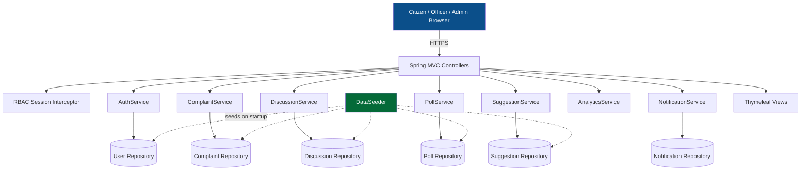
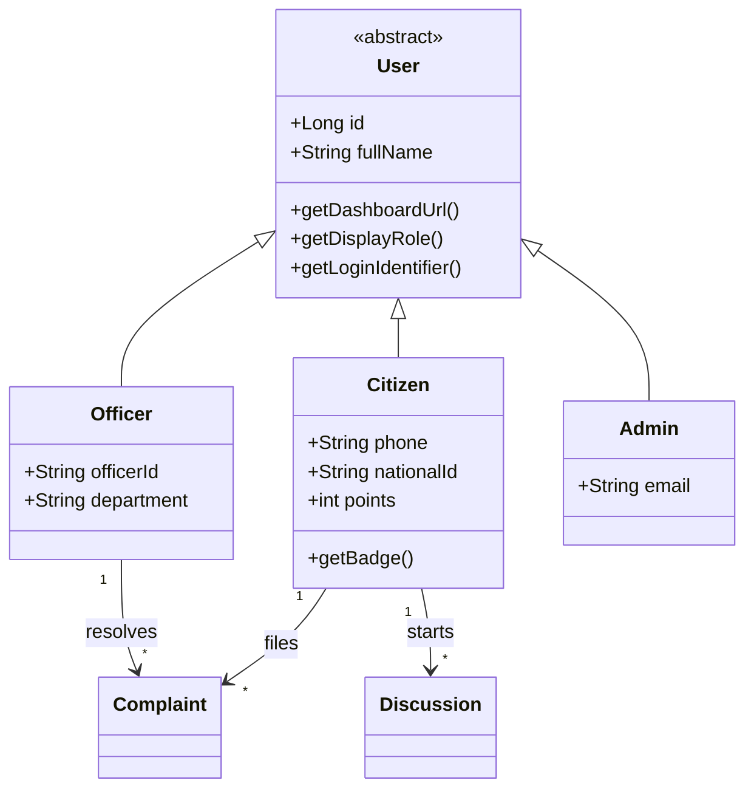

<div align="center">

<!-- Animated Typing Header -->
<a href="https://github.com/pbs002-s/OpenGovtBD">
  
</a>

<br/>

<!-- Banner GIF -->


<br/><br/>

<!-- Badges -->


</div>

---

## 📖 About The Project

**OpenGovtBD** (ওপেন গভর্নমেন্ট বিডি) is a full-stack **Government Citizen Engagement Platform** built for Bangladesh, designed to close the gap between everyday citizens and the government services meant to serve them.

Instead of chasing different offices, hotlines, and disconnected government sites, citizens get **one platform** to file complaints and track their resolution, join moderated public discussions, vote in official polls, submit suggestions, and reach every digital government service — while officers and administrators get dedicated dashboards to respond, moderate, and measure it all.

This is a genuine object-oriented Java project (abstract `User` hierarchy, layered service/repository architecture) — not a template renderer — built as a functional demo with realistic seeded data so every screen is explorable immediately after cloning.

<div align="center">

</div>

---

## 🧭 Table of Contents

- [About](#-about-the-project)
- [Key Features](#-key-features)
- [System Architecture](#-system-architecture)
- [Tech Stack](#-tech-stack)
- [Project Structure](#-project-structure)
- [Getting Started](#-getting-started)
- [Demo Accounts](#-demo-accounts)
- [Design System](#-design-system)
- [What's Left To Build](#-whats-left-to-build)
- [Benefits](#-benefits)
- [Team](#-team)
- [Contributing](#-contributing)
- [License](#-license)

---

## ✨ Key Features

| Feature | Description |
|---|---|
| 🔐 **Role-Based Authentication** | Separate login for Citizen, Government Officer, and Super Admin — OTP-verified citizen registration, simulated 2FA/MFA for officials |
| 📝 **Complaint Lifecycle Tracking** | Submit → Assigned → In Progress → Resolved/Rejected, with a full audit timeline, officer replies, star ratings, and reopen flow |
| 💬 **Moderated Discussion Forums** | Citizens post, officers approve/reject/pin/lock, with likes, comments, bookmarks & official government responses |
| 📊 **Official Polls & Voting** | One vote per citizen, live animated results, poll archive with final tallies |
| 💡 **Suggestion Box** | Community upvotes/downvotes, full status workflow with government feedback |
| 🏆 **Gamification** | Points, badge tiers (New → Bronze → Silver → Gold → Platinum), citizen leaderboard |
| 🚨 **Emergency Services Hub** | One-tap Police / Fire / Ambulance / Helpline access, nearby facility directory |
| 🏛️ **Digital Services Directory** | Quick links to NID, passport, land record, tax, trade license, and more |
| 🔔 **Smart Notification Center** | Real-time, typed alerts for every status change that affects a citizen |
| 📈 **Admin Analytics Dashboard** | Live charts — complaints by category/division, resolution rate, system-wide stats |
| 🌗 **Light & Dark Mode** | Persisted, animated theme toggle |
| 📱 **Fully Responsive** | Sidebar app-shell that collapses into a slide-in mobile drawer |

<div align="center">

</div>

---

## 🏗️ System Architecture



### Domain Model (OOP Core)



---

## 🛠️ Tech Stack

<div align="center">


</div>

> **Note:** this demo build uses in-memory, thread-safe repositories (no external database required to run it) so it's instantly explorable after cloning. See [What's Left To Build](#-whats-left-to-build) for the path to a persistent, production-grade version.

---

## 📁 Project Structure

```
OpenGovtBD/
├── src/main/java/com/opengovtbd/
│   ├── model/           # Abstract User + Citizen/Officer/Admin, Complaint,
│   │                    # Discussion, Poll, Suggestion, Notification, enums
│   ├── repository/      # In-memory, thread-safe data access layer
│   ├── service/         # All business logic — Auth, Complaint, Discussion,
│   │                    # Poll, Suggestion, Notification, Reward, Analytics
│   ├── controller/      # Spring MVC controllers, one per role/feature
│   ├── config/          # RBAC session interceptor, MVC config, DataSeeder
│   └── OpenGovtBDApplication.java
├── src/main/resources/
│   ├── templates/       # Thymeleaf views (fragments/, auth/, citizen/, officer/, admin/, error/)
│   ├── static/          # css/style.css, js/main.js
│   └── application.properties
├── design.md            # Full design system reference
├── product-spec.md      # Product spec — how it works & what's left to build
├── pom.xml
└── README.md
```

---

## 🚀 Getting Started

### Prerequisites
- Java 17+
- Maven 3.8+

### Installation

```bash
# Clone the repository
git clone https://github.com/pbs002-s/OpenGovtBD.git
cd OpenGovtBD

# Run the application (no database setup needed for the demo)
mvn spring-boot:run
```

The app will be available at **`http://localhost:8080`**

<div align="center">

</div>

---

## 🔑 Demo Accounts

Pre-seeded on startup — no signup required to explore:

| Role | Login | Password |
|---|---|---|
| 🧑 Citizen | Phone `01700000000` | `citizen123` |
| 🧑 Citizen (alt) | Phone `01812345678` | `citizen123` |
| 🏛️ Government Officer | ID `OFC-1001`, Email `kamrul.hasan@dhaka.gov.bd` | `officer123` |
| 🛡️ Super Admin | Email `admin@opengovtbd.gov.bd` | `admin123` |

New citizens can also register from scratch — the OTP screen shows the demo code (`123456`) directly, since no real SMS gateway is wired up yet.

---

## 🎨 Design System

Full design tokens, typography, spacing, component states, and animation timing live in [`design.md`](./design.md) — including the signature **"bridge" motif** (two nodes, Citizens ↔ Government, joined by an animated connecting arc) used throughout the brand.

<div align="center">

</div>

---

## 🔮 What's Left To Build

This is a functional demo, not a production system yet. Full breakdown in [`product-spec.md`](./product-spec.md) — the short version:

- [ ] Persistent database (currently in-memory, resets on restart)
- [ ] Password hashing + real authentication security
- [ ] Real OTP/SMS gateway + real 2FA/MFA
- [ ] Real file upload storage for complaint attachments
- [ ] GPS-based complaint location detection
- [ ] Full Bangla localization (currently partial)
- [ ] Department-scoped officer permissions
- [ ] Automated test suite
- [ ] REST API layer for external/mobile clients

---

## 🎯 Benefits

> Increasing transparency. Improving engagement. Simplifying access.

OpenGovtBD strengthens trust between citizens and government by:

- ✅ Giving every complaint a visible, trackable status
- ✅ Centralizing scattered government services into one place
- ✅ Encouraging active civic participation through gamification
- ✅ Requiring officer moderation before public content goes live
- ✅ Making system-wide performance visible via analytics

---

## 👥 Team

<div align="center">

| Role | Name |
|---|---|
| 👨‍💻 **Team Member-1 (Lead)** | Pronob Das |
| 👨‍💻 **Team Member-2** | Pritam Biswas |
| 👨‍💻 **Team Member-3** | Md Mahabub Rahaman |
| 👨‍💻 **Team Member-4** | Shreya Golder |
| 👨‍💻 **Team Member-5** | Anurag Barmon |

| | |
|---|---|
| 🎓 **Program** | B.Tech CSE, Daffodil International University (DIU) |
| 🌐 **Portfolio** | [Pritam Biswas](https://pritam-biswas-portfolio.netlify.app) |
| 💻 **GitHub** | [@pbs002-s](https://github.com/pbs002-s) | [@mahabub-rahaman-001](https://github.com/mahabub-rahaman-001)

</div>

---

## 🤝 Contributing

Contributions, issues, and feature requests are welcome! Feel free to fork the repo and submit a pull request.

```bash
git checkout -b feature/AmazingFeature
git commit -m "Add some AmazingFeature"
git push origin feature/AmazingFeature
```

---

## 📄 License

Distributed under the MIT License. See `LICENSE` for more information.

<div align="center">

### ⭐ If you find this project useful, give it a star!


**Made with ☕ and Java — OpenGovtBD, a bridge between citizens and government.**

</div>
